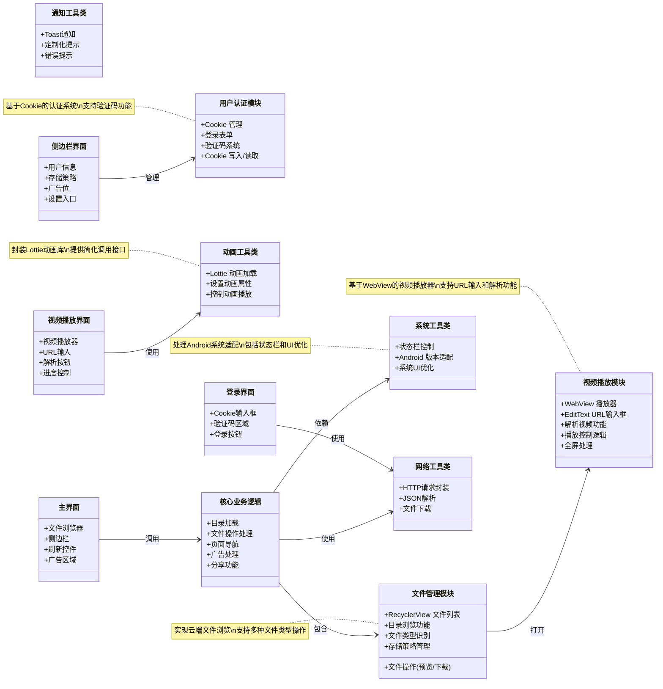

# CdifitClient

## [UML.md](UML.md)


## 基础特性
1. 基于移动端应用 `iApp` 开发的 **CdifitClient** 客户端软件
2. 采用 MIT 开源协议，分发时需注明原项目地址

## TERR
```tree
./
├── AndroidManifest.xml
├── JiYU.mtsx
├── LICENSE
├── README.md
├── UML.md
├── apk/
│ ├── assets/
│ │ └── extra_conf1g.xml
│ └── lib/
│     ├── Lottiesx
│     ├── ts.dex.i
│     └── tw
├── app_webview/
│ ├── BrowserMetrics-spare.pma
│ ├── Default/
│ │ ├── Cookies
│ │ ├── Cookies-journal
│ │ ├── Local Storage/
│ │ │ └── leveldb/
│ │ │     ├── 000004.log
│ │ │     ├── 000005.ldb
│ │ │     ├── CURRENT
│ │ │     ├── LOCK
│ │ │     ├── LOG
│ │ │     └── MANIFEST-000001
│ │ ├── PersistentOriginTrials/
│ │ │ ├── LOCK
│ │ │ └── LOG
│ │ ├── Service Worker/
│ │ │ ├── Database/
│ │ │ │ ├── 000003.log
│ │ │ │ ├── CURRENT
│ │ │ │ ├── LOCK
│ │ │ │ ├── LOG
│ │ │ │ └── MANIFEST-000001
│ │ │ └── ScriptCache/
│ │ │     ├── index
│ │ │     └── index-dir/
│ │ │         └── the-real-index
│ │ ├── Session Storage/
│ │ │ ├── 000003.log
│ │ │ ├── CURRENT
│ │ │ ├── LOCK
│ │ │ ├── LOG
│ │ │ └── MANIFEST-000001
│ │ ├── Shared Dictionary/
│ │ │ ├── cache/
│ │ │ │ ├── index
│ │ │ │ └── index-dir/
│ │ │ │     └── the-real-index
│ │ │ ├── db
│ │ │ └── db-journal
│ │ ├── Web Data-journal
│ │ ├── Web-Data
│ │ ├── WebStorage/
│ │ │ ├── QuotaManager
│ │ │ └── QuotaManager-journal
│ │ ├── blob_storage/
│ │ │ └── 714156d8-99a3-48b3-986d-d904a9c2a971/
│ │ └── shared_proto_db/
│ │     ├── 000003.log
│ │     ├── CURRENT
│ │     ├── LOCK
│ │     ├── LOG
│ │     ├── MANIFEST-000001
│ │     └── metadata/
│ │         ├── 000003.log
│ │         ├── CURRENT
│ │         ├── LOCK
│ │         ├── LOG
│ │         └── MANIFEST-000001
│ ├── last-exit-info
│ ├── pref_store
│ ├── variations_seed_new
│ ├── variations_stamp
│ └── webview_data.lock
├── bin/
│ └── CdifitClient_0.1.16_dp.Apk
├── docs/
├── files/
│ ├── ByUsi/
│ │ ├── Cdifit/
│ │ │ └── ggao.html
│ │ └── Config.json
│ ├── System/
│ │ ├── Config/
│ │ │ └── sidebar
│ │ ├── Cookie
│ │ ├── ResourceLinkCache/
│ │ │ └── DWkqil
│ │ └── homeList.json
│ └── temp/
│     ├── VideoPlayer2/
│     │ ├── artplayer.css
│     │ ├── artplayer.js
│     │ ├── flv.js
│     │ ├── hls.js
│     │ ├── index.htm
│     │ └── res/
│     │     ├── background.jpg
│     │     ├── indicator.svg
│     │     ├── load.gif
│     │     ├── ploading.gif
│     │     └── state.svg
│     ├── ad.html
│     ├── cca.html
│     └── clickAdvertisement
├── icon.png
├── res/
│ ├── VideoPlayer2.zip
│ ├── byusi/
│ │ ├── html/
│ │ │ ├── captcha.html
│ │ │ └── graphPreview.html
│ │ ├── logo/
│ │ │ ├── byusi.png
│ │ │ ├── cdifit.png
│ │ │ └── properos.png
│ │ └── resources/
│ │     ├── ApplicationUseIcon/
│ │     │ ├── ic_settings_application_and_service.png
│ │     │ └── ic_settings_privacy.png
│ │     ├── Lottie/
│ │     │ ├── 0.005020299610974055.json
│ │     │ ├── 0.json
│ │     │ ├── 1.json
│ │     │ ├── 2.json
│ │     │ ├── 3.json
│ │     │ ├── 4.json
│ │     │ ├── 404.json
│ │     │ ├── 5.json
│ │     │ ├── 6.json
│ │     │ ├── ByUsi/
│ │     │ │ ├── 404.json
│ │     │ │ ├── accomplish.json
│ │     │ │ ├── ai.json
│ │     │ │ ├── loading.json
│ │     │ │ └── loading2.json
│ │     │ ├── app.json
│ │     │ ├── complete.json
│ │     │ ├── error.json
│ │     │ ├── file.json
│ │     │ ├── gome.json
│ │     │ ├── home.json
│ │     │ ├── list.json
│ │     │ ├── loading.json
│ │     │ ├── message.json
│ │     │ ├── message1.json
│ │     │ ├── my.json
│ │     │ ├── ok.json
│ │     │ ├── rocket.json
│ │     │ ├── thecharts.json
│ │     │ ├── true.json
│ │     │ ├── yes.json
│ │     │ ├── 中国国旗.json
│ │     │ ├── 人物.json
│ │     │ ├── 图标运动图形2.json
│ │     │ ├── 屏幕02洛蒂导出.json
│ │     │ ├── 提醒铃铛.json
│ │     │ ├── 文件夹下载.json
│ │     │ ├── 星球.json
│ │     │ ├── 现金流的骨架.json
│ │     │ ├── 菜单开关.json
│ │     │ ├── 跑2圈.json
│ │     │ ├── 骨架骨骼动画.json
│ │     │ └── 骷髅卡•愿望列表网格.json
│ │     ├── icon/
│ │     │ ├── file-earmark.png
│ │     │ ├── file-pdf.png
│ │     │ ├── filetype-aac.svg
│ │     │ ├── filetype-ai.svg
│ │     │ ├── filetype-bmp.svg
│ │     │ ├── filetype-cs.svg
│ │     │ ├── filetype-css.png
│ │     │ ├── filetype-csv.svg
│ │     │ ├── filetype-doc.png
│ │     │ ├── filetype-docx.png
│ │     │ ├── filetype-exe.png
│ │     │ ├── filetype-gif.png
│ │     │ ├── filetype-heic.svg
│ │     │ ├── filetype-html.png
│ │     │ ├── filetype-jpg.png
│ │     │ ├── filetype-js.svg
│ │     │ ├── filetype-json.svg
│ │     │ ├── filetype-jsx.svg
│ │     │ ├── filetype-key.svg
│ │     │ ├── filetype-m4p.svg
│ │     │ ├── filetype-md.png
│ │     │ ├── filetype-mdx.svg
│ │     │ ├── filetype-mov.svg
│ │     │ ├── filetype-mp3.png
│ │     │ ├── filetype-mp4.png
│ │     │ ├── filetype-otf.svg
│ │     │ ├── filetype-php.svg
│ │     │ ├── filetype-ppt.svg
│ │     │ ├── filetype-pptx.svg
│ │     │ ├── filetype-psd.svg
│ │     │ ├── filetype-py.png
│ │     │ ├── filetype-raw.svg
│ │     │ ├── filetype-rb.svg
│ │     │ ├── filetype-sass.svg
│ │     │ ├── filetype-scss.svg
│ │     │ ├── filetype-sh.svg
│ │     │ ├── filetype-sql.svg
│ │     │ ├── filetype-svg.svg
│ │     │ ├── filetype-tiff.svg
│ │     │ ├── filetype-tsx.svg
│ │     │ ├── filetype-ttf.svg
│ │     │ ├── filetype-txt.svg
│ │     │ ├── filetype-wav.svg
│ │     │ ├── filetype-woff.svg
│ │     │ ├── filetype-xls.svg
│ │     │ ├── filetype-xlsx.svg
│ │     │ ├── filetype-xml.png
│ │     │ ├── filetype-yml.png
│ │     │ ├── folder.png
│ │     │ └── music-note-beamed.png
│ │     ├── template/
│ │     │ └── json/
│ │     │     ├── StoragePolicySwitching.json
│ │     │     ├── login_information.json
│ │     │     ├── picturePreview.json
│ │     │     └── share.json
│ │     └── ttf/
│ │         ├── 001hh1.ttf
│ │         ├── acbt80.ttf
│ │         ├── bb2325.ttf
│ │         ├── z_c.TTF
│ │         ├── z_x.TTF
│ │         └── zt.TTF
│ ├── sdk/
│ │ └── player.bysi.sdk
│ ├── ts0.png
│ ├── ts1.png
│ ├── ts2.png
│ ├── tw/
│ │ └── twtb.png
│ └── wallpaper/
│     └── DefaultWallpaper_1.png
└── src/
    ├── Lottie.myu
    ├── StoragePolicySettings.iyu
    ├── View.myu
    ├── a.mjava
    ├── bfq2.iyu
    ├── byusi.myu
    ├── core.myu
    ├── dir.iyu
    ├── hlist.iyu
    ├── home.iyu
    ├── janz1.iyu
    ├── list.iyu
    ├── login.iyu
    ├── mian.iyu
    ├── music.iyu
    ├── picturePreview.iyu
    ├── sidebar.iyu
    ├── tw.myu
    ├── web.iyu
    ├── webView.mjava
    └── window.iyu

49 directories, 213 files
```