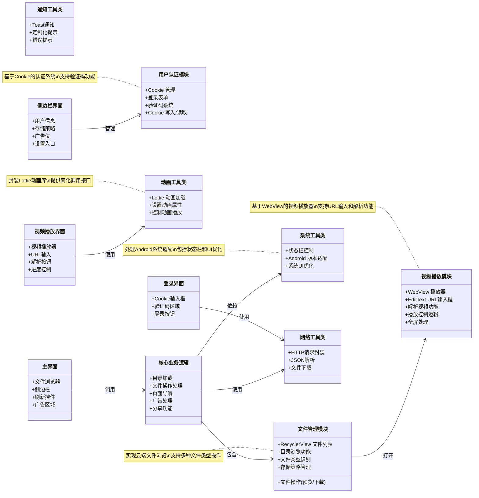

# CdifitClient

## [UML.md](UML.md)

```mermaid
classDiagram
    direction LR
    
    %% 核心功能模块
    class 视频播放模块 {
        +WebView 播放器
        +EditText URL输入框
        +解析视频功能
        +播放控制逻辑
        +全屏处理
    }
    
    class 文件管理模块 {
        +RecyclerView 文件列表
        +目录浏览功能
        +文件类型识别
        +文件操作(预览/下载)
        +存储策略管理
    }
    
    class 用户认证模块 {
        +Cookie 管理
        +登录表单
        +验证码系统
        +Cookie 写入/读取
    }
    
    %% 工具类
    class 动画工具类 {
        +Lottie 动画加载
        +设置动画属性
        +控制动画播放
    }
    
    class 系统工具类 {
        +状态栏控制
        +Android 版本适配
        +系统UI优化
    }
    
    class 网络工具类 {
        +HTTP请求封装
        +JSON解析
        +文件下载
    }
    
    class 通知工具类 {
        +Toast通知
        +定制化提示
        +错误提示
    }
    
    %% 业务逻辑
    class 核心业务逻辑 {
        +目录加载
        +文件操作处理
        +页面导航
        +广告处理
        +分享功能
    }
    
    %% 界面组件
    class 主界面 {
        +文件浏览器
        +侧边栏
        +刷新控件
        +广告区域
    }
    
    class 视频播放界面 {
        +视频播放器
        +URL输入
        +解析按钮
        +进度控制
    }
    
    class 登录界面 {
        +Cookie输入框
        +验证码区域
        +登录按钮
    }
    
    class 侧边栏界面 {
        +用户信息
        +存储策略
        +广告位
        +设置入口
    }
    
    %% 关系定义
    主界面 --> 核心业务逻辑 : 调用
    视频播放界面 --> 动画工具类 : 使用
    登录界面 --> 网络工具类 : 使用
    核心业务逻辑 --> 文件管理模块 : 包含
    核心业务逻辑 --> 系统工具类 : 依赖
    核心业务逻辑 --> 网络工具类 : 使用
    文件管理模块 --> 视频播放模块 : 打开
    侧边栏界面 --> 用户认证模块 : 管理
    
    %% 注释说明
    note for 视频播放模块 "基于WebView的视频播放器\n支持URL输入和解析功能"
    note for 文件管理模块 "实现云端文件浏览\n支持多种文件类型操作"
    note for 用户认证模块 "基于Cookie的认证系统\n支持验证码功能"
    note for 动画工具类 "封装Lottie动画库\n提供简化调用接口"
    note for 系统工具类 "处理Android系统适配\n包括状态栏和UI优化"
```

## 基础特性
1. 基于移动端应用 `iApp` 开发的 **CdifitClient** 客户端软件
2. 采用 MIT 开源协议，分发时需注明原项目地址
