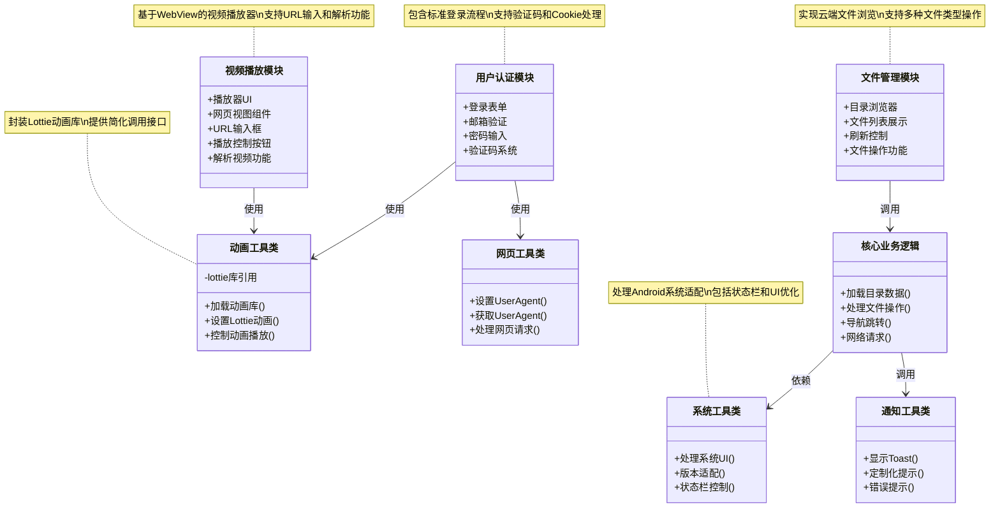

```mermaid
classDiagram
    direction TB

    %% 核心功能模块
    class 视频播放模块 {
        +播放器UI
        +网页视图组件
        +URL输入框
        +播放控制按钮
        +解析视频功能
    }

    class 文件管理模块 {
        +目录浏览器
        +文件列表展示
        +刷新控制
        +文件操作功能
    }

    class 用户认证模块 {
        +登录表单
        +邮箱验证
        +密码输入
        +验证码系统
    }

    %% 工具类
    class 动画工具类 {
        +加载动画库()
        +设置Lottie动画()
        +控制动画播放()
        -lottie库引用
    }

    class 网页工具类 {
        +设置UserAgent()
        +获取UserAgent()
        +处理网页请求()
    }

    class 系统工具类 {
        +处理系统UI()
        +版本适配()
        +状态栏控制()
    }

    class 通知工具类 {
        +显示Toast()
        +定制化提示()
        +错误提示()
    }

    %% 业务逻辑
    class 核心业务逻辑 {
        +加载目录数据()
        +处理文件操作()
        +导航跳转()
        +网络请求()
    }

    %% 关系定义
    文件管理模块 --> 核心业务逻辑 : 调用
    视频播放模块 --> 动画工具类 : 使用
    用户认证模块 --> 动画工具类 : 使用
    用户认证模块 --> 网页工具类 : 使用
    核心业务逻辑 --> 系统工具类 : 依赖
    核心业务逻辑 --> 通知工具类 : 调用

    %% 注释说明
    note for 视频播放模块 "基于WebView的视频播放器\n支持URL输入和解析功能"
    note for 文件管理模块 "实现云端文件浏览\n支持多种文件类型操作"
    note for 用户认证模块 "包含标准登录流程\n支持验证码和Cookie处理"
    note for 动画工具类 "封装Lottie动画库\n提供简化调用接口"
    note for 系统工具类 "处理Android系统适配\n包括状态栏和UI优化"
```