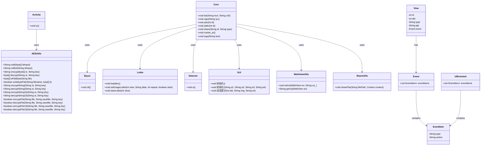

```mermaid
classDiagram
    class Activity {
        +void tz()
    }

    class AESUtils {
        +String md5(byte[] btInput)
        +String md5st(String btInput)
        +String encrypt(byte[] st, String key)
        +byte[] decrypt(String st, String key)
        +byte[] toFileByte(String file)
        +boolean writebyteFile(String filename, byte[] b)
        +String encryptString(String st, String key)
        +String decryptString(String st, String key)
        +String encryptString16(String st, String key)
        +String decryptString16(String st, String key)
        +boolean encryptFile(String file, String savefile, String key)
        +boolean decryptFile(String file, String savefile, String key)
        +boolean encryptFile16(String file, String savefile, String key)
        +boolean decryptFile16(String file, String savefile, String key)
    }

    class Core {
        +void list(String hurl, String url2)
        +void uigo(String iyu)
        +void adv(int id)
        +void addv(int id)
        +void share(String id, String type)
        +void cookie_qr()
        +void logs(String text)
    }

    class Byusi {
        +void ztl()
    }

    class Lottie {
        +void loaddex()
        +void setImageLottie(int view, String data, int repeat, boolean start)
        +void startLottie(int view)
    }

    class Selector {
        +void a()
    }

    class XUI {
        +void 初始化()
        +void 初始化(String a1, String a2, String a3, String a4)
        +void 动态提示(int did, String img, String txt)
    }

    class WebViewUtils {
        +void setUa(WebView wv, String ua_)
        +String getUa(WebView wv)
    }

    class ShareUtils {
        +void shareFile(String filePath, Context context)
    }

    class View {
        -int id
        -int did
        -String type
        -String ppt
        -Event event
    }

    class Event {
        -List~EventItem~ eventItems
    }

    class EventItem {
        -String type
        -String action
    }

    class UIEventset {
        -List~EventItem~ eventItems
    }

    Activity --> AESUtils : uses
    Core --> Byusi : uses
    Core --> Lottie : uses
    Core --> Selector : uses
    Core --> XUI : uses
    Core --> WebViewUtils : uses
    Core --> ShareUtils : uses
    View --> Event : has
    Event --> EventItem : contains
    UIEventset --> EventItem : contains
```